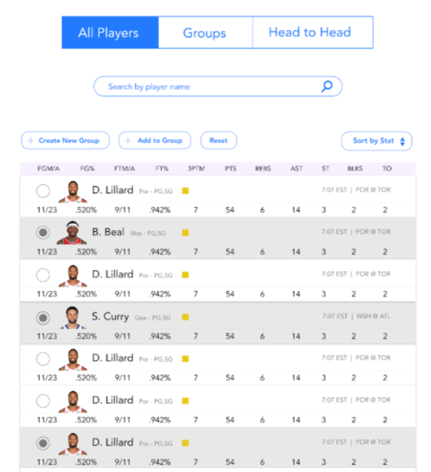
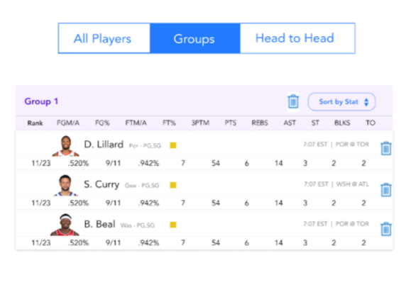
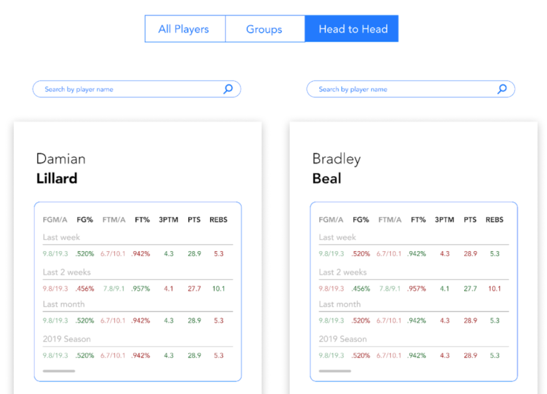
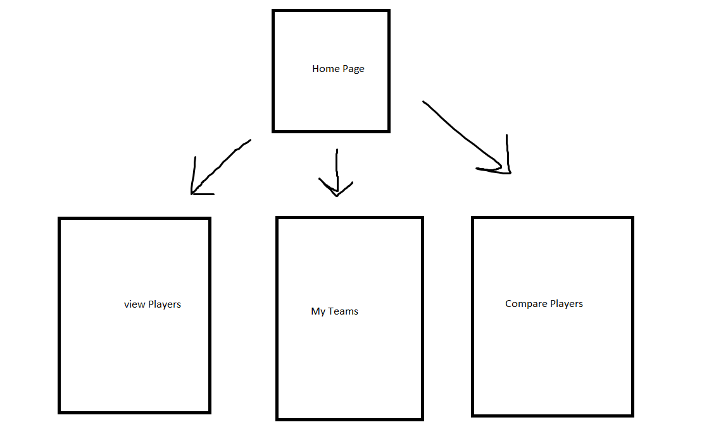

# Fantasyzer 

## Overview

Problem: When scrolling through NBA player stats online there are hundreds of players and no way to compare smaller subsets of players for fantasy picks. Example: If you are looking at the ESPN stats table below and you want to compare player 2 (Bradley Beal), 9 (Kevin Durant) and 13 (Nikola Jokic) you have to look through the noise of the other 9 players that are in between which presents a poor user experience.

Solution: An NBA player comparison website that lets you create your own sortable tables of players as well as compare players head to head. 

## Data Model

The application will store Users, Players Data, and Lists

* users can have multiple player lists (via references)
* each list can have multiple statistics (by embedding)

(___TODO__: sample documents_)

An Example User:

```javascript
{
  username: "Fantasy Player 1",
  hash: // a password hash,
  lists: // an array of references to User's Fantasy Teams
}
```

An Example List with Embedded Stats:

```javascript
{
  user: // a reference to a User object
  name: "Fantasy Team 1",
  stats: [
    { player: "LeBron James", team: "Los Angeles Lakers", Age: "36"},
    { player: "Stephen Curry", team: "Golden State Warriors", Age: "33"},
  ],
  createdAt: // timestamp
}
```

## [Link to Commented First Draft Schema](db.js) 

## Wireframes

/viewPlayers - page for viewing players



/myTeams - page for showing user's fantasy teams



/comparePlayers - page for comparing player statistics



## Site map



## User Stories or Use Cases

1. As a fantasy basketball user I want to be able to view a sortable table of all the players in the NBA so I can explore different players to consider drafting/adding to my fantasy team
2. As a fantasy basketball user I want to be able to create a sortable table of a smaller subset of players in the NBA so I can more directly compare/track a group of players that I’m still considering drafting/adding to my fantasy team
3. As a fantasy basketball user I want to be able to view a player’s current and past statistics against another player and see which player does better in each statistic so I can directly compare two players that I’m considering drafting/adding to my fantasy team

## Research Topics

* (3 points) Integrate user authentication
    * Not sure what user authentication I will be using
    * Users can create accounts to keep track of their fantasy teams
    * Will possibly user passport.js for authentication
* (2 points) Scrape data for NBA statistics using NBA api
    * create a search form to be able search players
    * be able to select players to compare
    * be able to sort by specific statistics
* (3 points) React.js and Ant
    * use React.js as the frontend framework'
    * use Ant as the library for frontend components

## [Main Project File](app.js) 

## Annotations / References Used

(___TODO__: list any tutorials/references/etc. that you've based your code off of_)

1. [passport.js authentication docs](http://passportjs.org/docs)
2. [tutorial on React.js](https://reactjs.org/)
3. [NBA api](https://github.com/swar/nba_api)
